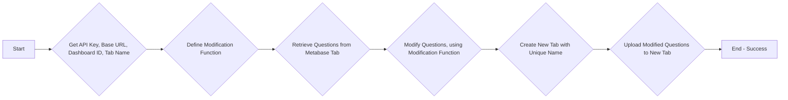

Metabase Dashboard Question Duplicator and Modifier

This Python script utilizes the Metabase API to duplicate questions from a specific dashboard tab and upload them to a new tab with modifications.

> [!WARNING]  
> Use with caution as it modifies your Metabase dashboard. Use a duplicated test dashboard first.

Functionality

    Retrieves Questions: The script retrieves questions from a specified tab within a Metabase dashboard using the provided API key and base URL.
    Applies Modifications: A provided function allows you to modify the retrieved questions before creating duplicates. This function can be used to change question names, descriptions, or other properties.
    Creates New Tab: The script creates a new tab with a unique name (e.g., "Modified - {original_tab_name}") within the same dashboard.
    Uploads Modified Questions: The modified questions are uploaded as cards to the newly created tab.
    

Usage

    Requirements:

    Python 3
    requests library (install using pip install requests)

    API_KEY: Replace YOUR_API_KEY in the script with your actual Metabase API key.
    BASE_URL: Replace https://your-metabase-domain.com with the base URL of your Metabase instance.
    DASBOARD_ID & TAB_NAME: Update the dashboard_id and tab_name variables with the ID of the dashboard containing the target tab and the name of the tab itself.
    Modification Function: Define a function named modify_question that takes a question dictionary as input and returns the modified dictionary. Refer to the example provided in the script for guidance.
    Run the Script: Execute the script using python metabase_question_duplicator.py (replace metabase_question_duplicator.py with your actual filename).

Example

The script includes an example modify_question_name function that simply appends " (Modified)" to the question name. You can modify this function to perform more complex operations on the question data.

Note: This script requires appropriate permissions within Metabase to access dashboards, tabs, and create new content.
Contributing

We welcome contributions to improve this script. Feel free to submit pull requests for bug fixes, new features, or improved functionalities.
